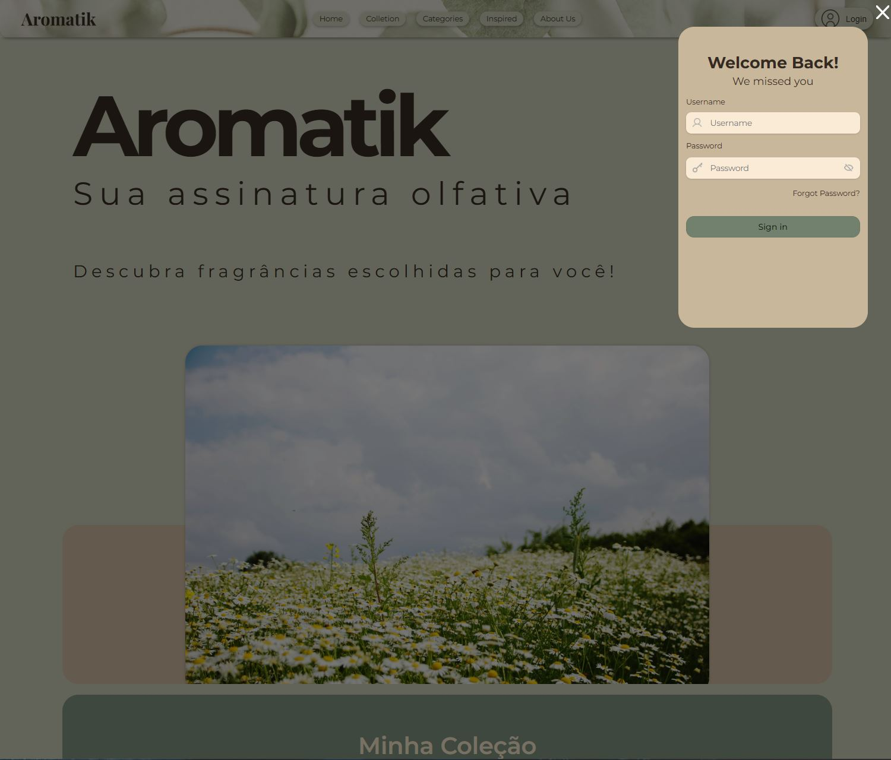
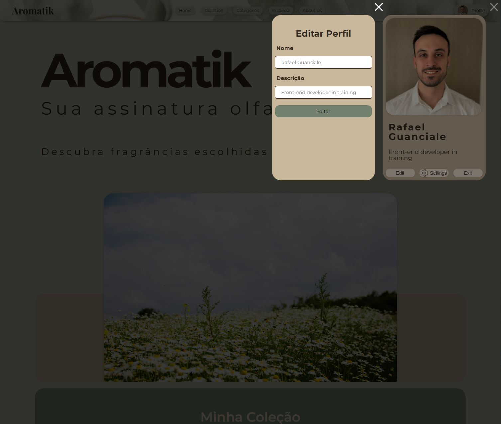
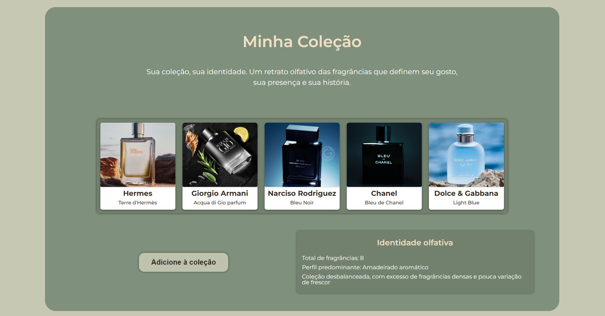

# Aromatik 1.6 — Front-end Web App

**visualizar projeto:** https://rafaguanciale.github.io/Aromatik/

O Aromatik é um projeto pessoal desenvolvido em paralelo às sprints do curso de Web Development da TripleTen. Ele funciona como um laboratório contínuo de evolução, onde aplico de forma prática os conceitos aprendidos em HTML, CSS e JavaScript, sempre com foco em organização, clareza, escalabilidade e visão de produto.

A partir da versão 1.6, o Aromatik deixa de ser apenas um site interativo e passa a se comportar como uma aplicação front-end com:

- Controle de estado
- Interface reativa
- Sistema de modais empilháveis
- Validação dinâmica de formulários
- Simulação de autenticação

Objetivo do Projeto

O Aromatik não é um catálogo de perfumes.
A proposta é funcionar como uma ferramenta de leitura de coleção pessoal, ajudando o usuário a:

- Visualizar sua coleção de forma organizada
- Entender o perfil predominante das fragrâncias
- Refletir sobre equilíbrio, uso e identidade olfativa
- Contextualizar cada perfume dentro do todo

## Tecnologias Utilizadas

- HTML5
- CSS3
- Flexbox e Grid Layout
- Arquitetura modular de CSS
- JavaScript (ES6+)
- Manipulação dinâmica de DOM
- Templates HTML (<template>)
- Controle de estado com variável booleana
- Validação nativa de formulário (validity)
- Sistema de modais reutilizável
- Metodologia BEM
- Google Fonts

## Principais Funcionalidades e Soluções Técnicas

1. Sistema de Autenticação (UI-only)

- Modal de login com validação dinâmica
- Feedback visual em tempo real 
- Simulação de estado de usuário logado via variável
- Header reativo ao estado
- Logout com confirmação
- Separação clara entre mudança de estado e atualização da UI

2. Sistema de Modais Empilháveis

- Funções reutilizáveis
- Controle de scroll do body
- Fechamento via overlay e ESC
- Lógica de fechamento do último modal aberto (Stack behavior)
- Remoçào segura de listeneres apenas quando o último modal é fechado

3. Edição de perfil

- Modal dedicado para edição
- Preenchimento automático do formulário com dados atuais
- Atualização dinâmica do nome e descrição no profile
- Separação entre leitura e escrita de dados

4. Coleção de Perfumes (Cards Dinâmicos)

- Cards criados dinamicamente a partir de um template HTML
- Estrutura clara com imagem, marca e nome do perfume
- Layout responsivo utilizando CSS Grid
- Hover sutil com transições controladas
- Remoção de cards com controle correto de eventos (event bubbling)

5. Adição de Perfumes via Modal

- Modal dedicado para adicionar novos perfumes
- Formulário controlado com JavaScript
- Criação dinâmica de novos cards
- Reset do formulário após submissão
- Estrutura preparada para persistência futura (LocalStorage)

## Decisões Arquiteturais Importantes

- Separação entre lógica de validação e lógica de aplicação
- Interface controlada por estado
- Centralização de atualização visual em função única
- Tratamento correto de múltiplos modais
- Evitar duplicação de listeners

## Aprendizados Pessoais

A versão 1.6 marcou uma evolução significativa no pensamento estrutural:

- Entendimento real de event bubbling
- Controle de múltiplos modais simultâneos
- Gerenciamento de estado em aplicações frond-end
- Separação de responsabilidades
- UI ORIENTADA POR ESTADO
- Uso correto de querySelectorAll para comportamento em pilha
- Estruturação mais limpa de funções reutilizáveis

Houve uma transição de mentalidade:
De "site com modais" para "aplicação com estado e fluxo controlado".

## Melhorias Futuras (Roadmap)

Aromatik 1.7

- Persistência de login possivelmente com LocalStorage
- Refatorar a validação para função reutilizável
- Implementar estrutura de dados em objetos

Aromatik 2.0

- Inteligência da coleção baseada em regras
- Análises automáticas do perfil olfativo
- Recomendações por contexto (clima, período)
- Persistência completa com LocalStorage
- Front-end finalizado como app pessoal

## Screenshots

Header

Coleção

Card Modal

Categorias

