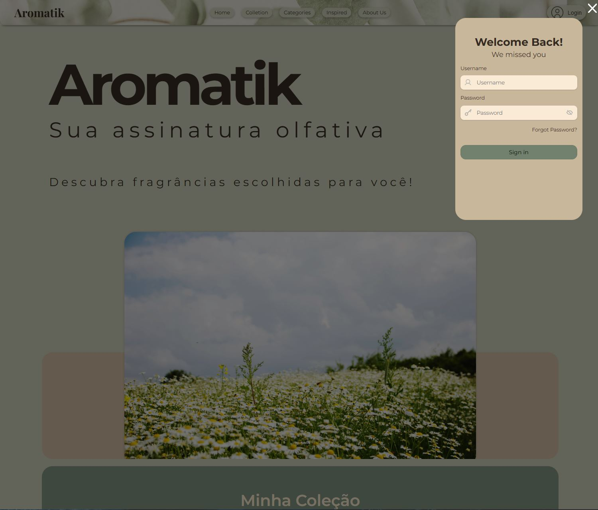
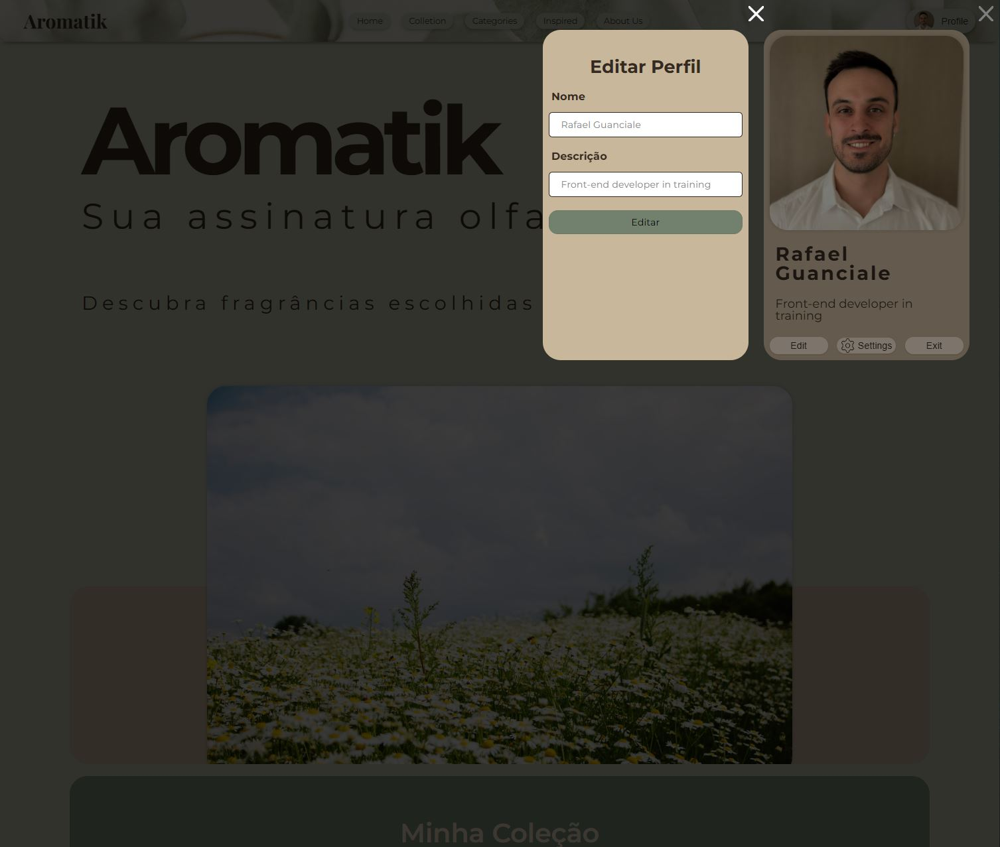
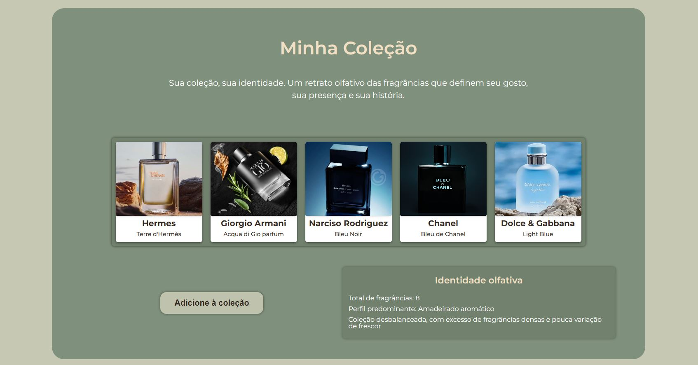
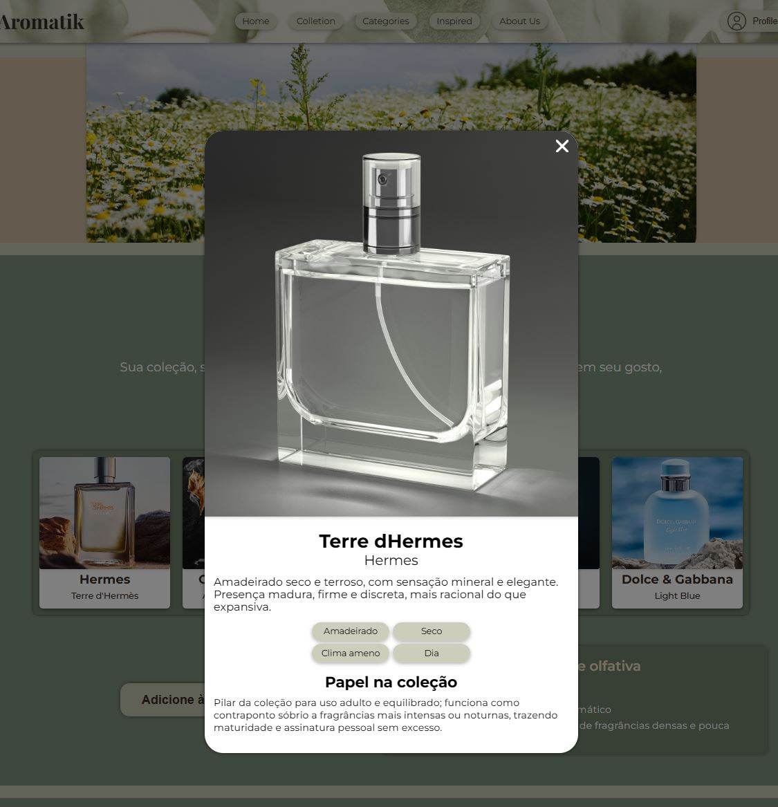
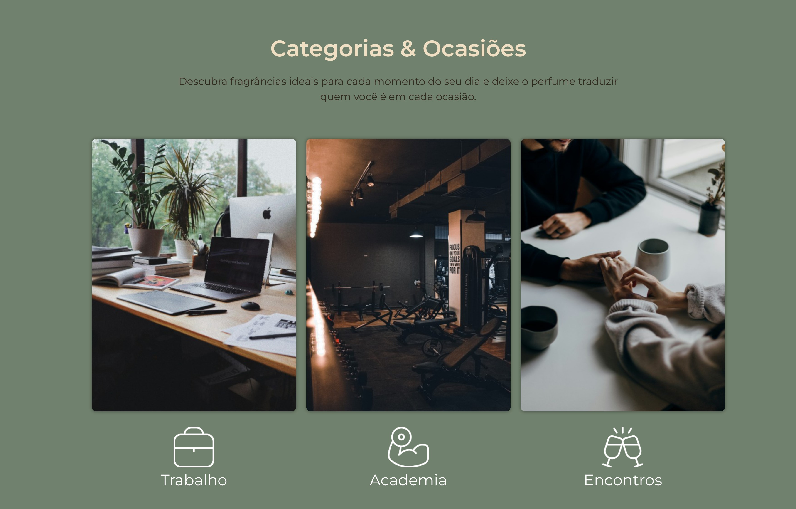

# Aromatik 1.8 — Front-end Web App

**visualizar projeto:** https://rafaguanciale.github.io/Aromatik/

O Aromatik é um projeto pessoal desenvolvido em paralelo às sprints do curso de Web Development da TripleTen. Ele funciona como um laboratório contínuo de evolução, onde aplico de forma prática os conceitos aprendidos em HTML, CSS e JavaScript, sempre com foco em organização, clareza, escalabilidade e visão de produto.

A partir da versão **1.8**, o projeto consolida a base como um **mini app front-end orientado a objetos**, com **classes reutilizáveis**, **index enxuto orquestrando** e **UI guiada por estado**.

- Controle de estado
- Interface reativa
- Sistema de modais empilháveis
- Validação dinâmica de formulários
- Simulação de autenticação

## Objetivo do projeto

O Aromatik **não é um catálogo de perfumes**.  
A proposta é funcionar como uma ferramenta de leitura de coleção pessoal, ajudando o usuário a:

- Visualizar a coleção de forma organizada
- Entender padrões e “perfil predominante” da coleção
- Contextualizar fragrâncias por uso/ocasião
- Manter uma experiência de navegação com modais e fluxo de aplicação

## Tecnologias Utilizadas

- HTML5 
- CSS3 
- Metodologia BEM
- Arquitetura modular de CSS (por blocos)
- JavaScript (ES6+)
- Manipulação de DOM
- POO com classes (ES Modules)
- Validação de formulários (FormValidator)
- Sistema de modais reutilizável (Popup / PopupWithForm)
- Google Fonts

## Principais funcionalidades e soluções técnicas

1. **Sistema de modais reutilizável (POO)**
- Classe `Popup` responsável por abrir/fechar, overlay e ESC
- Controle de scroll do body ao abrir modal
- Fechamento correto do **último modal aberto** ao pressionar ESC (comportamento em pilha)

2. **Formulários com classe genérica (`PopupWithForm`)**
- Captura de dados via `name=""` dos inputs 
- Handlers no `index.js` ficam responsáveis apenas pela regra de negócio
- Reset do form no `close()` (comportamento consistente)

3. **Coleção (cards) com `Section` + `Card`**
- Renderização inicial por `Section` a partir de `cardData`
- `Card` gera o elemento via template e registra listeners internos
- Remoção de card com confirmação e controle correto de propagação de evento

4. **Edição de perfil com `UserInfo`**
- `getUserInfo()` para preencher o form com os dados atuais
- `setUserInfo()` para atualizar UI com os valores enviados pelo popup

5. **UI reativa ao login (`HeaderUi`)**
- Header muda ícone, classe e texto conforme estado (`loggedIn()` / `loggedOut()`)
- Login e logout alteram o estado e chamam a atualização visual

6. **Refactor de conteúdo “Inspired”**
- Remoção da section fixa “Inspired”
- Transformação em **modal** (abre a partir da área de categorias), melhorando o fluxo de navegação

## Decisões arquiteturais

- `index.js` como **orquestrador**: instâncias + listeners + bootstrap
- Classes com responsabilidade única:
- `Popup` (comportamento base de modal)
- `PopupWithForm` (submit e coleta de inputs)
- `Section` (render/gestão do container)
- `Card` (template + listeners internos)
- `UserInfo` (leitura/escrita de dados do perfil)
- `HeaderUi` (estado visual do header)

## Aprendizados pessoais

- Construção de classes “do zero” (estrutura, responsabilidade e API)
- Redução de acoplamento: inputs por `name` e coleta pelo próprio form
- Separação real entre **UI**, **estado** e **orquestração**
- Evolução de “site com modais” para “aplicação com fluxo controlado”

## Melhorias futuras (roadmap)

- Persistência de login e coleção (ex.: LocalStorage)
- Modal de card dinâmico (abrir com dados do card clicado)
- Ajustes finos de responsividade e microinterações (transições/feedback)

## Screenshots

Header

Coleção

Card Modal

Categorias
