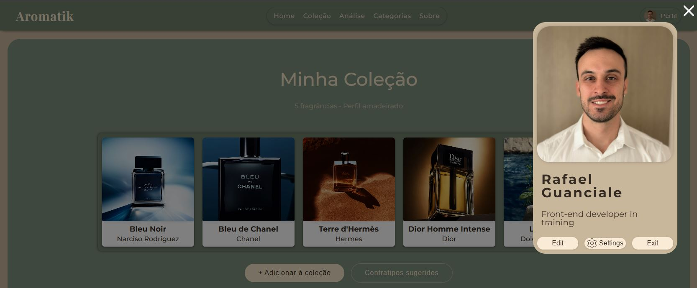
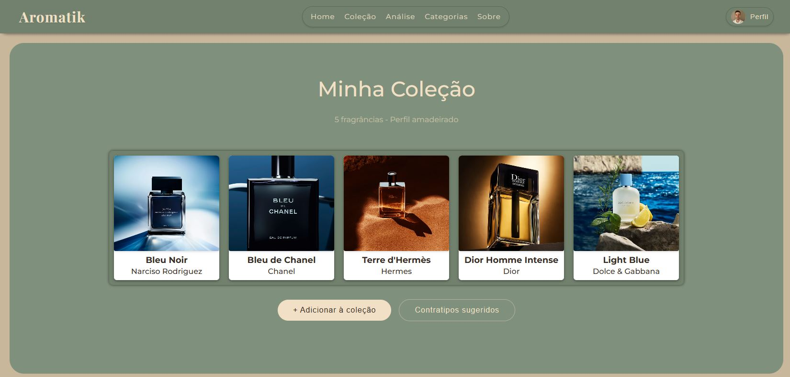
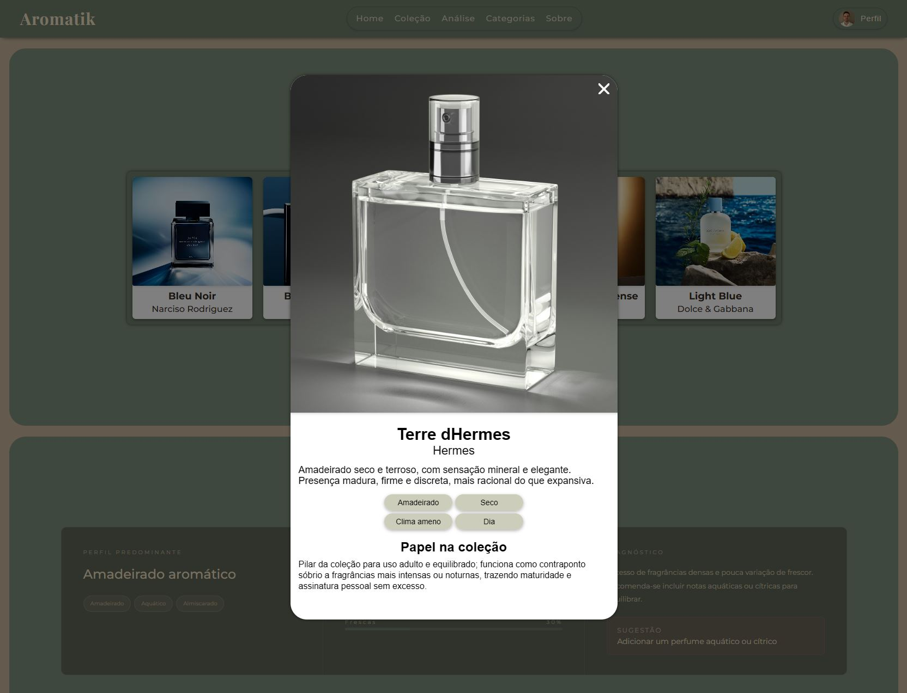
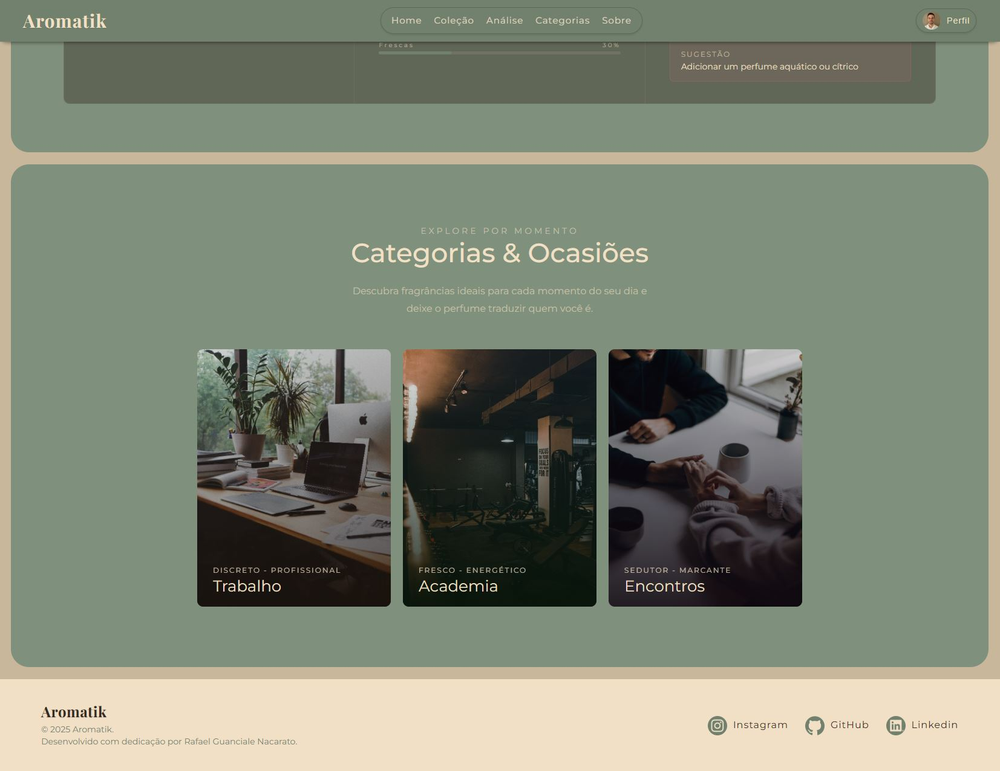
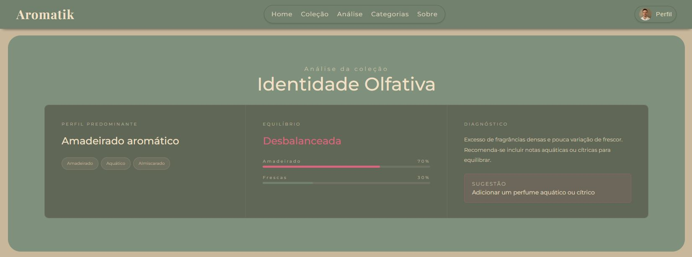

# Aromatik 1.9 — Front-end Web App

**visualizar projeto:** https://rafaguanciale.github.io/Aromatik/

O Aromatik é um projeto pessoal desenvolvido em paralelo às sprints do curso de Web Development da TripleTen. Ele funciona como um laboratório contínuo de evolução, onde aplico de forma prática os conceitos aprendidos em HTML, CSS e JavaScript, sempre com foco em organização, clareza, escalabilidade e visão de produto.

A partir da versão **1.9**, o projeto dá um salto significativo: deixa de ser apenas uma aplicação front-end estática e passa a se comunicar com uma **API local real**, com persistência de dados, autenticação conectada ao servidor e uma identidade visual completamente redesenhada.

## Objetivo do projeto

O Aromatik **não é um catálogo de perfumes**.  
A proposta é funcionar como uma ferramenta de leitura de coleção pessoal, ajudando o usuário a:

- Visualizar sua coleção de forma organizada
- Entender o perfil predominante das fragrâncias
- Descobrir se a coleção está balanceada e o que incluir para completá-la
- Explorar fragrâncias por categoria e ocasião
- Navegar por fluxos próximos de uma aplicação real, com autenticação e persistência

## Tecnologias Utilizadas

- HTML5
- CSS3
- Metodologia BEM
- Arquitetura modular de CSS (por blocos)
- JavaScript (ES6+)
- Manipulação de DOM
- POO com classes (ES Modules)
- Validação de formulários (FormValidator)
- Sistema de modais reutilizável (Popup / PopupWithForm)
- Google Fonts 
- Node.js + npm
- json-server (API REST local)
- Fetch API + Promises
- localStorage (persistência de sessão)

## API local (json-server)

A versão 1.9 introduz uma API REST local construída com **json-server**, hospedada em um repositório separado (`aromatik-api`). A API expõe três endpoints:

- `/users` — dados de autenticação do usuário
- `/perfumes` — catálogo de fragrâncias disponíveis
- `/collection` — coleção pessoal do usuário (referências por `perfumeId`)

Para rodar a API localmente:
```bash
cd aromatik-api
npx json-server db.json
```

## Principais funcionalidades e soluções técnicas

1. **Classe `Api` com métodos de comunicação**
   - `checkApi()` — verifica se a API está online antes de qualquer requisição
   - `getUserLogin(username)` — busca usuário por username para autenticação
   - `getCollection()` — busca os itens da coleção do usuário
   - `getPerfumeById(id)` — busca dados completos de um perfume pelo id
   - `searchPerfume(name)` — busca perfume no catálogo por nome
   - `addToCollection(data)` — adiciona perfume à coleção (POST com `perfumeId`)
   - `removeFromCollection(id)` — remove item da coleção (DELETE)

2. **Sistema de login conectado à API**
   - Validação real de usuário e senha contra o servidor
   - Três cenários tratados: usuário inexistente, senha inválida e login correto
   - Persistência de sessão via `localStorage`
   - Restauração automática do estado de login ao recarregar a página

3. **Fallback para GitHub Pages**
   - `checkApi()` determina se a API está disponível
   - Quando offline: login simulado + cards estáticos do array local
   - Quando online: fluxo completo conectado à API
   - Permite que visitantes do portfólio experimentem a aplicação sem rodar a API

4. **Coleção dinâmica via API**
   - Carregamento inicial com `getCollection()` + `Promise.all()` para buscar perfumes em paralelo
   - Adição de perfumes via busca no catálogo + `addToCollection()`
   - Remoção com `removeFromCollection()` — DOM atualizado apenas após confirmação do servidor

5. **UI dinâmica por estado de login**
   - Classe `Ui` (evolução da `HeaderUi`) controla todas as sections
   - Antes do login: sections de coleção e categorias ocultas
   - Após login: home, sobre e autor ocultados — coleção e categorias reveladas
   - Estado restaurado automaticamente via `localStorage`

6. **Redesign visual completo**
   - Nova identidade com Playfair Display + Montserrat
   - Paleta refinada: Champagne, Reseda Green, Bistre, Khaki e Blush
   - Hero com layout split e divisória diagonal em SVG
   - Section "Sobre o Aromatik" com mockups reais do projeto
   - Section "Sobre mim" com foto biografia e overlay com gradiente
   - Divisores Khaki entre sections
   - Elementos decorativos sutis (círculos concêntricos na section 2)
   - Box-shadow e hover em mockups, foto e botões
   - Cards de categoria com efeito de expansão e reveal no hover (CSS puro)

## Decisões arquiteturais

- `index.js` como **orquestrador**: instâncias, listeners, bootstrap e verificação de API
- Separação clara entre **fluxo com API** e **fluxo sem API** em todos os handlers
- Classes com responsabilidade única:
  - `Api` (comunicação com o servidor)
  - `Popup` / `PopupWithForm` (modais)
  - `Section` (renderização de listas)
  - `Card` (template + listeners)
  - `UserInfo` (leitura/escrita de perfil)
  - `Ui` (estado visual global da aplicação)

## Aprendizados pessoais

- Construção de uma API REST do zero com json-server
- Modelagem de banco de dados com recursos relacionados (perfumes × collection)
- Fetch API com encadeamento de Promises e `Promise.all()`
- Persistência de estado com `localStorage`
- Arquitetura de fallback para ambientes sem servidor
- Design system completo: paleta, tipografia, espaçamentos e componentes
- Separação real entre estado, UI e orquestração

## Melhorias futuras (roadmap v2.0)

- Reescrita completa em **React**
- Componentização de cards, modais e formulários
- Gerenciamento de estado com `useState` e `useEffect`
- Integração com API externas (Claude / Fragella)
- Sistema de avaliações e notas por perfume
- Filtros e busca por categoria, ocasião e estação
- Persistência completa com backend real
- Perfil do usuário com estatísticas da coleção

## Screenshots

Header



Coleção


Card Modal


Categorias


Identidade Olfativa

